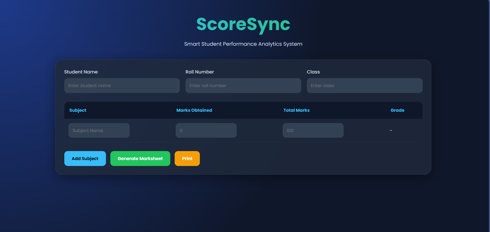

# 📊 ScoreSync

ScoreSync is a smart student performance analytics web application that converts raw marks into meaningful insights. It helps teachers and students generate marksheets, analyze performance, and track academic progress using modern UI and intelligent calculations.

## 🌐 Live Demo

🔗 https://koyalMaity007.github.io/ScoreSync/

## 📷 Screenshot

## 🚀 Features

- 📄 PDF Report Generation – Download professional marksheets  
- 📊 Performance Analytics – Visual insights into student performance  
- 🧠 AI Recommendations – Smart improvement suggestions  
- 💾 Student Data Storage – Manage student records easily  
- 🔐 Login System – Secure access for users  
- 🌐 SaaS Ready Web App – Fully responsive and scalable design  
- 🧮 Auto Grade & GPA Calculator – Instant evaluation system  
- 🖨️ Print Support – Generate printable certificates  

## 🛠️ Tech Stack

- HTML5  
- CSS3  
- JavaScript (Vanilla JS)

## ⚙️ How It Works

1. Enter student details (name, roll number, class)  
2. Add subjects and marks  
3. Click Generate Marksheet  
4. View analytics, grades, GPA, and AI feedback  
5. Download or print report  

## 💡 Key Highlights

- Automatic grade calculation  
- Best & weakest subject detection  
- Growth rate analysis  
- AI-based performance suggestions  
- Clean modern UI  

## 📁 Project Structure

ScoreSync/
├── index.html
├── scroresync.css
├── scroresync.js
└── README.md

## 👨‍💻 Developer

Built with ❤️ for modern education analytics.